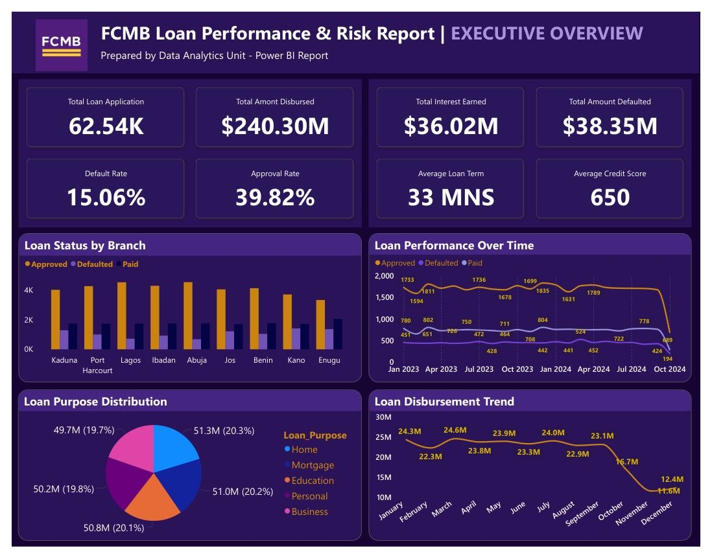
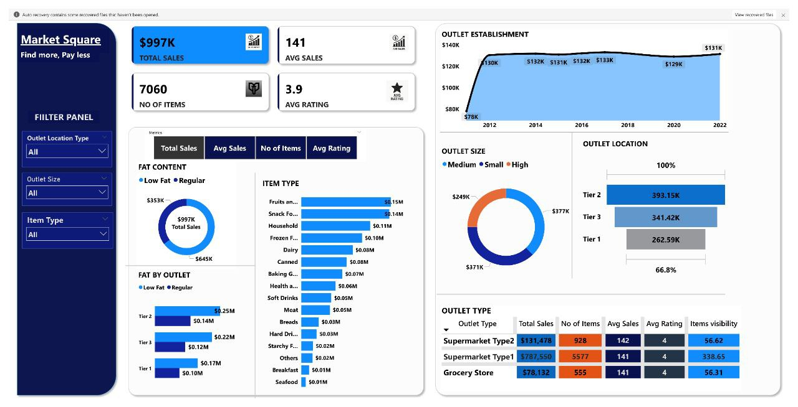

# 📚 Data Analyst Portfolio  

Welcome to my Data Analyst Portfolio, a curated collection of real-world analytics projects I’ve built using Power BI, Excel, SQL, and other data tools.  

My analytical work reflects a strong interest and growing specialization in Financial Data Analytics, particularly in understanding loan performance, credit risk, and business KPI monitoring.  

---

## 👋 About Me  

I am a passionate and detail-driven Data Analyst with increasing focus on leveraging data to support decision-making in financial and business environments.  

I specialize in:  
- 🏦 Financial Data Analytics (Loan performance, credit risk, KPI reporting)  
- 📊 Business Intelligence & Dashboard Development (Power BI)  
- 🗂️ Data Cleaning, Modeling & Transformation  
- 📈 Insight Storytelling & Reporting  
- 🧩 Problem Solving with Data  

My goal is to keep building deeper expertise in financial analytics, while applying analytical thinking to broader business contexts.  

---

# 💼 Skills Matrix  

| Skill Category | Skills |
|----------------|--------|
| Financial Analytics | Loan performance analysis, Default rate calculation, Risk monitoring, Portfolio analysis, KPI development |
| Data Analysis | Data cleaning, transformation, aggregation, trend analysis, segmentation |
| Business Intelligence | Power BI dashboards, DAX measures, drill-down visuals, interactive reporting |
| Data Modeling | Star schema design, relationships, fact/dimension modeling |
| Tools & Technologies | Power BI, Excel, SQL, Power Query |
| Soft Skills | Attention to detail, critical thinking, insight storytelling, problem solving |

---

# 🛠️ Tech Stack  

---

# 🚀 Featured Projects  

---

# 1️⃣ FCMB Loan Performance & Risk Analysis Dashboard  
Domain: Financial Analytics  
Tools: Power BI, Power Query, DAX  
[📥 Download Power BI File (FCMB 8.pbit)](./FCMB%208.pbit)

---

## 🖼️ Project Preview

---

## 📘 Project Overview  
This Power BI report provides a full analysis of loan performance for FCMB, focusing on key financial indicators such as disbursement patterns, approval rates, defaults, interest income, borrower categories, and branch-level activity.

It offers stakeholders a clear view of:  
- Loan portfolio health  
- Risk insights  
- Revenue contribution via interest  
- Borrower behavior  
- Branch performance  
- Year-over-year changes  

This project strongly reflects my growing direction in Financial Data Analytics.

---

## 🔎 Objectives  
- Evaluate how loans are performing across years, categories, and branches  
- Monitor risk metrics including defaults and repayments  
- Understand revenue generation from interest  
- Identify which borrower groups or branches contribute most to loan activity  
- Provide insights to support lending decisions and risk mitigation  

---

## 📊 Key Insights  
- Total Disbursed: $240.30M  
- Interest Earned: $36.02M  
- Default Rate: 15.06%  
- Business loans recorded the highest disbursement volume  
- Defaults decreased significantly from 2023 to 2024  
- Kaduna & Lagos branches showed strong loan activity  

---

## 🎯 Recommendations  
- Strengthen credit checks in high-default regions  
- Promote loan products with lower risk exposure  
- Optimize performance-based funding to top-performing branches  
- Improve financial literacy awareness for high–risk borrower groups  

---

---

# 2️⃣ Retail Sales & Outlet Performance Dashboard  
Domain: Business Analytics  
Tools: Power BI, Power Query, DAX 
[Download MARKET SQUARE.pbix](./MARKET%20SQUARE.pbix)

---

## 🖼️ Project Preview

---

## 📘 Project Overview  
A Power BI dashboard that analyzes retail sales performance, covering outlet productivity, revenue trends, customer ratings, product category breakdown, and multi-year performance insights.

---

## 📊 Key Insights  
- Medium-sized outlets achieved the highest revenue  
- Tier 2 locations consistently outperformed Tier 1 & Tier 3  
- Supermarket Type 2 led in profitability  
- Product availability strongest in Type 2 outlets  

---

## 🎯 Recommendations  
- Increase inventory for high-performing outlet tiers  
- Expand category offerings where revenue contribution is highest  
- Improve customer engagement in low-rating regions  
- Scale operations in Tier 2 for long-term growth  

---

# 🗂️ Portfolio Structure

---

# 📫 Contact  

- 📞 Phone: 09162351135  
- 🔗 LinkedIn: https://www.linkedin.com/in/daniel-agbo-6021b2291  
- 📧 Email: agbodaniel757@gmail.com  

---

⭐️ *Thank you for viewing my portfolio. More financial analytics projects coming soon.*
